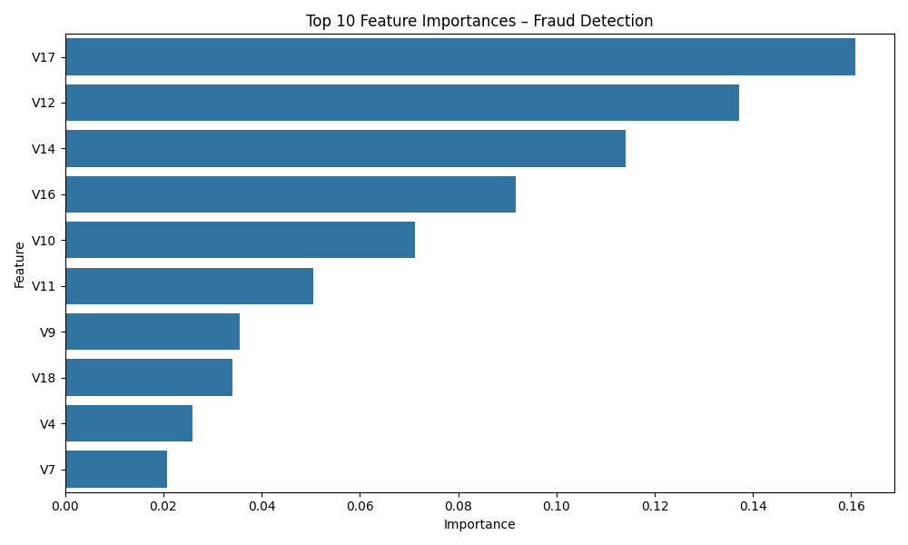

# Credit Card Fraud Detection

This project demonstrates a machine learning pipeline to detect fraudulent credit card transactions using **Logistic Regression** and **Random Forest** classifiers. The project handles imbalanced datasets, performs feature scaling, and evaluates model performance using classification metrics and confusion matrices.

---

## Table of Contents
- [Dataset](#dataset)
- [Project Workflow](#project-workflow)
- [Modeling](#modeling)
- [Evaluation](#evaluation)
- [Feature Importance](#feature-importance)
- [Saving Model](#saving-model)
- [Usage](#usage)
- [Dependencies](#dependencies)

---

## Dataset
The dataset `creditcard.csv` contains credit card transactions labeled as fraudulent (`Class=1`) or non-fraudulent (`Class=0`). The dataset is highly imbalanced, with the majority of transactions being non-fraudulent.  

- **Number of Features:** 30  
- **Target Column:** `Class` (0: Non-Fraud, 1: Fraud)  
- **Total Samples:** `df.shape` (e.g., 284,807 rows)  

---

## Project Workflow
The workflow includes the following steps:

1. **Import Libraries** – Load required Python libraries for data manipulation, visualization, and machine learning.
2. **Load Dataset** – Read the CSV file into a pandas DataFrame.
3. **Explore Class Imbalance** – Visualize the distribution of fraudulent vs non-fraudulent transactions.
4. **Feature & Target Separation** – Split the dataset into features (`X`) and target (`y`).
5. **Train-Test Split** – Split the data into training and testing sets using stratification to maintain class proportions.
6. **Feature Scaling** – Standardize features to improve model performance.
7. **Baseline Model** – Train a Logistic Regression model as a baseline.
8. **Random Forest Model** – Train a Random Forest classifier on the dataset.
9. **Evaluation** – Evaluate models using classification metrics.
10. **Confusion Matrix** – Visualize model predictions against actual labels.
11. **Feature Importance** – Identify the most influential features for fraud detection.
12. **Model Saving** – Save the trained model and scaler for future use.

---

## Modeling
### Logistic Regression
- Used as a baseline classifier.
- Applied on **scaled features**.
- Maximum iterations set to 1000 for convergence.

### Random Forest Classifier
- Ensemble-based model used for improved performance.
- Number of trees: 100
- Can handle non-scaled features and captures non-linear patterns effectively.

---

## Evaluation
The models are evaluated using:

- **Precision, Recall, F1-Score** – Especially important for imbalanced datasets.
- **Confusion Matrix** – Visual representation of True Positives, False Positives, True Negatives, and False Negatives.

Example of confusion matrix visualization:


---

## Feature Importance
Random Forest provides a ranking of features based on their contribution to predicting fraud.  
Top features are visualized in a bar chart:



---

## Saving Model
The trained Random Forest model and the StandardScaler are saved using `joblib`:

```python
joblib.dump(rf_model, "random_forest_fraud_model.pkl")
joblib.dump(scaler, "scaler.pkl")
